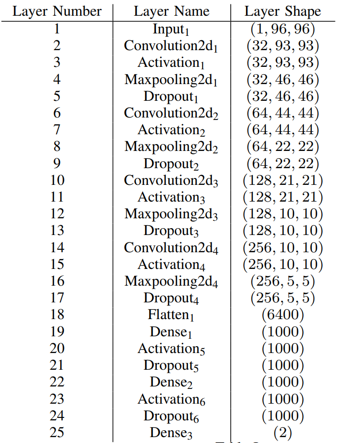
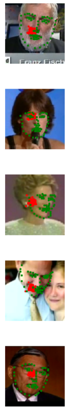
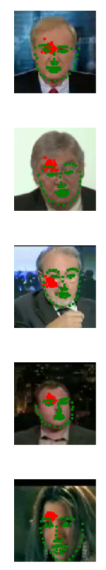

# Facial Keypoint Detection

In this project, we train a **Deep CNN** to perform facial keypoint detection by *regression*. We apply a **68 keypoints** detection for a single face that captures facial features such as eyes, mouth and edges of jaws. Each point has its own (x,y) coordinates in the 2D space.


## Our dataset

The training data of this project are extracted from the [Youtube Face Dateset](https://www.cs.tau.ac.il/~wolf/ytfaces/) , which includes the input images for the network. The labels of the training data are stored in the CSV file in the data folder with the corresponding (x,y) coordinates.  Below is a demonstration of facial landmarks when plotted on the training image. Each keypoint is associated with the facial feature of the person. In addition, the points themselves maintain a relative special relation.


### Constructing `data_loader` and `transformations`

The entire dataset contains **3462** images for training and **2308** images for testing.

We will construct our data into `torch.utils.data.Dataset` class to load our data, later. The `FacialKeypointsDataset`inheret from the `Dataset` class, and we will overwrite the `__getitem__` to return a `sample` dictionary that contains {image, keypoints, image_name}.


```python
def __getitem__(self, idx):
        image_name = self.key_pts_frame.iloc[idx,0]
        image_name_path = os.path.join(self.root_dir,image_name)
        
        image = mpimg.imread(image_name_path)
        
        # if image has an alpha color channel, get rid of it
        if(image.shape[2] == 4):
            image = image[:,:,0:3]
        
        key_pts = self.key_pts_frame.iloc[idx,1:].as_matrix()
        key_pts = key_pts.astype('float').reshape(-1,2) # reshape to represent (x,y) coordinates
        sample = {'image': image, 'keypoints': key_pts, 'name':image_name}
        
        if self.transform:  # if transform(s) specified, then perform them
            sample = self.transform(sample)
            
        return sample
```

A series of transformations are performed on the training images before feeding them to the neural network. The transformations are defined in the `data_load.py` file. Operations are performed in the sequence of: Rescale the input image to (250,250) $\to$ randomly crop a (224,224) section from the image $\to$ converting the image to grayscale and normalize pixel value as well as keypoints coordinates $\to$ convert the image to pytorch tensor.

```python
data_transform = Compose([Rescale(250), # rescale both image size and keypoint coordinates
                          RandomCrop(224), # randomly crop out 224x224 pixels
                          Normalize(), # This would convert the image to grayscale first. 
                                       # Color channel to [0,1]. 
                                       # keypoint channel standardize mean = 100, std = 50
                          ToTensor()])
```

## Model

We consider <span style="color:red">**two CNN models**</span> in this project.
#### Model version 1 is a self-designed CNN

This model is a **modified** implementation of the [Orginal Paper](https://arxiv.org/pdf/1710.00977.pdf).



It has **<span style="color:red">5</span>** Conv2d layers and **<span style="color:red">3</span>** fully-connected layers. Batch normalization and dropout layers are implemented for both Conv2d and Dense layer.(*adding dropout layer to Conv2d is not very trendy nowadays*)

The CNN model is defined in the `models.py` file

#### Model version 2 is the famous ResNet 50

**ResNet50** is a more advanced CNN architecture that are popularly used for transfer learning where we retain the weights in the network that are trained using the image-net. In addition, we would remove its top layer and customize our own output layers to the objective of our application. In this case, the output layer would be a `nn.Linear(512,136)` layer that predict 136 features which corresponds to our facial landmarks.

We import the **ResNet50** architecture from `torchvision.models`. Also, download the pre-trained weights and freeze these layers so that they will not be trained later.
Lastly, remove the top layer(the classifier) and replace it with our desired output.

```python
from torchvision import models
from torch import nn
from collections import OrderedDict
model_Res = models.resnet50(pretrained=True)
for param in model_Res.parameters():
    param.requires_grad = False   # this prevents the early layers' weights to be trained
classifier = nn. Sequential(OrderedDict([
    ('fc1', nn.Linear(2048,512)),
    ('relu', nn.ReLU()),
    ('dropout', nn.Dropout(p=0.5)),
    ('fc2', nn.Linear(512,136))
]))
model_Res.fc = classifier  		# Replace the output layer to our customization
```

## Training

Before training, we can visualize our initialized facial landmarks:





### Training setup

